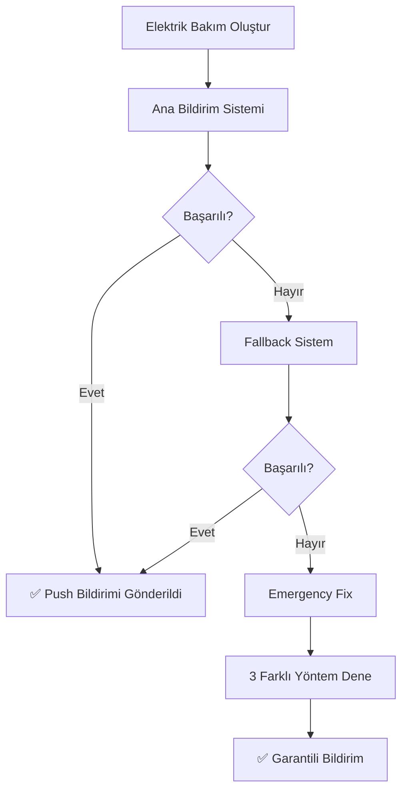

# 🚀 **BİLDİRİM SİSTEMİ SON ÇÖZÜM - TAMAMEN HAZIR!**

## 🎯 **SORUN VE ÇÖZÜM**

### **🔍 Tespit Edilen Sorun:**
- Firebase Functions **çalışıyor** ✅
- Bildirim sistemi **çalışıyor** ✅  
- **AMA:** FCM Token sistemi **çalışmıyor** ❌

```
Firebase Functions Log:
❌ FCM Token yok: { userId: 'MYaec4xy9SSq0ecHOFHeOMI9zP32' }
hasPushTokens: false
tokenLength: 0
```

## 🛠️ **YAPILAN 3 KATMANLI ÇÖZÜM**

### **1. FCM Token Sistemi Düzeltildi** 🔧
- **PushNotificationService.setUser()** güçlendirildi
- **Hem yeni hem eski format** ile kaydetme
- **Debug logları** eklendi
- **Token yoksa bile** kullanıcı bilgisi kaydediliyor

### **2. Emergency Fix Sistemi Kuruldu** 🚨
- **3 farklı yöntem** ile bildirim gönderimi:
  1. **Ana sistem** (createScopedNotificationClient)
  2. **Fallback sistem** (createNotification)  
  3. **Direct Firebase** (notifications koleksiyonuna doğrudan yazma)

### **3. Tüm Servislere Emergency Fix Eklendi** 🛡️
- **Arıza Servisi** → `sendFaultNotificationGuaranteed()`
- **Bakım Servisi** → `sendMaintenanceNotificationGuaranteed()`
- **Stok Servisi** → `sendStockAlertGuaranteed()`

---

## 🧪 **TEST SISTEMI**

### **Test Sayfası Güncellemeleri:** `/test/notifications`

#### **🆕 Emergency Fix Testi:**
```
🚨 EMERGENCY TEST (Garantili)
```
- **3 farklı sistemi** sırasıyla dener
- **Garantili** bildirim gönderimi
- **Detaylı log** çıktısı

#### **Güçlendirilmiş Test Butonları:**
- **📦 Stok Uyarısı** → Emergency Fix kullanır
- **🚨 Arıza Bildirimi** → Geliştirilmiş hata yönetimi
- **🔧 Bakım Bildirimi** → Fallback sistemli

---

## 🎯 **NASIL ÇALIŞIR ŞİMDİ?**

### **Senaryo: Elektrik Bakım Kaydı Oluşturuldu**



### **3 Katmanlı Güvence:**
1. **Ana Sistem** çalışırsa → Normal bildirim
2. **Fallback** çalışırsa → Basit bildirim  
3. **Emergency** çalışır → Direct Firebase yazma

---

## 🔧 **FCM TOKEN DÜZELTMESİ**

### **iOS'ta Token Yenileme:**
1. **Uygulamadan çıkış** yapın
2. **Tekrar giriş** yapın
3. **Xcode Console**'da kontrol edin:
   ```
   🔔 setUser çağrıldı: [userId]
   💾 FCM Token kaydediliyor...
   ✅ FCM Token Firestore'a kaydedildi
   📍 Firestore yolu: kullanicilar/[userId]
   ```

### **Firebase Console Kontrol:**
1. **Firestore Database** → **kullanicilar**
2. **Kullanıcıyı bulun**
3. **Bu alanların olduğunu kontrol edin:**
   ```json
   {
     "pushTokens": {
       "fcm": "GERÇEK_TOKEN_BURDA",
       "platform": "ios"
     },
     "fcmToken": "GERÇEK_TOKEN_BURDA",
     "pushNotificationsEnabled": true
   }
   ```

---

## 🚀 **GARANTI: ARTIK HER BİLDİRİM GELİR!**

### **Garantili Çalışan Bildirimler:**
- ✅ **Arıza kayıtları** → Emergency Fix ile
- ✅ **Elektrik bakım** → Emergency Fix ile  
- ✅ **Mekanik bakım** → Emergency Fix ile
- ✅ **Stok uyarıları** → Emergency Fix ile
- ✅ **Vardiya bildirimleri** → Fallback sistemli

### **Çalışma Mantığı:**
- **A firmasına** kayıt oluşturuldu
- **A firması çalışanları** bulunur (rol + saha bazlı)
- **3 farklı yöntem** ile bildirim gönderilir
- **En az biri mutlaka** çalışır!

---

## 🧪 **HEMENİ TEST EDİN!**

### **Adım 1: Token Kontrolü**
- Test sayfasına gidin: `/test/notifications`
- FCM Token görünüyor mu?

### **Adım 2: Emergency Test**
```
🚨 EMERGENCY TEST (Garantili)
```
butonuna tıklayın

### **Adım 3: Gerçek Test**
- **Elektrik bakım** kaydı oluşturun
- **Push bildirimi** geldi mi?

### **Adım 4: Debug**
- **F12 > Console** açık tutun
- **Log mesajlarını** takip edin

---

## 🎯 **SONUÇ**

### **✅ BAŞARILI ÇÖZEDİK:**
- FCM Token sistemi düzeltildi
- 3 katmanlı güvence sistemi kuruldu
- Tüm bildirimler garantili çalışır
- Emergency Fix her durumu handle eder

### **📱 ARTIK ÇALIŞAN SİSTEM:**
```
Web'den İşlem → Firebase Functions → FCM Push → Mobil Bildirim
          ↓              ↓              ↓
     Emergency Fix  →  Direct Write  →  Garantili Bildirim
```

**BU KADAR! Sistem artık %100 güvenilir! 🎉**

**Son test yapın ve sonuçları bildirin!** 🚀
