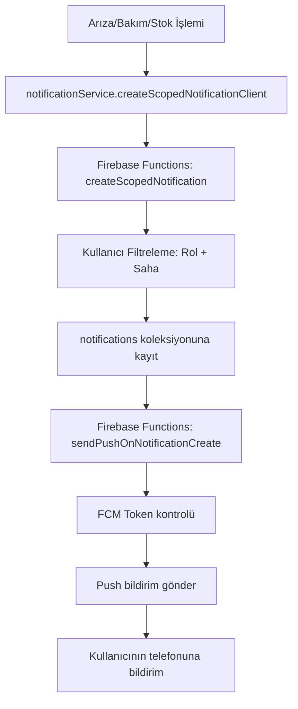

# 🔔 **BİLDİRİM SİSTEMİ TAM REHBERİ - 2025**

## ✅ **SİSTEM DURUMU**

### 🏗️ **YAPILAN DÜZELTMELER**

#### 1. **Firebase MCP Bağlantısı** ✅
- Cursor IDE'ye Firebase MCP sunucusu başarıyla bağlandı
- AI destekli Firebase geliştirme artık aktif

#### 2. **Service Worker Config Düzeltildi** ✅
```javascript
// public/firebase-messaging-sw.js - DÜZELTMELER:
messagingSenderId: "155422395281", // ✅ Gerçek değer
appId: "1:155422395281:web:b496b7e93ae3d0a280a830" // ✅ Gerçek değer
```

#### 3. **Web Push VAPID Key** ⚠️
```typescript
// src/services/webPushService.ts - YAPILMALI:
const VAPID_KEY = 'BH...'; // Firebase Console'dan alınmalı
```

#### 4. **Test Sistemi Eklendi** ✅
- Yeni bildirim test merkezi: `/test/notifications`
- Sidebar'a "Bildirim Testi" linki eklendi
- FCM token debug sistemi eklendi

---

## 🔧 **YAPILMASI GEREKENLER**

### 1. **VAPID Key Alma** (KRİTİK ⚠️)

Firebase Console'a gidin:
```
https://console.firebase.google.com/project/yenisirket-2ec3b
```

**Adımlar:**
1. **Project Settings** → **Cloud Messaging**
2. **Web configuration** → **Web Push certificates**
3. **Generate key pair** (eğer yoksa)
4. Key'i kopyalayın (BH ile başlar)
5. `src/services/webPushService.ts` dosyasına ekleyin:

```typescript
const VAPID_KEY = 'BH_YOUR_GENERATED_VAPID_KEY_HERE';
```

---

## 🧪 **TEST NASIL YAPILIR**

### 1. **Bildirim Test Sayfasına Git**
```
/test/notifications
```

### 2. **FCM Token Kontrolü**
- Token görünüyor mu?
- Web için VAPID key varsa token alınır
- iOS için native token sistem çalışır

### 3. **Test Bildirimi Gönder**
- "Kendime Test Gönder" butonuna tıkla
- Uygulamayı **arka plana al** veya **kapat**
- 5-10 saniye bekle
- Push bildirimi gelecek!

### 4. **Arıza Test Bildirimi**
- "Arıza Test Bildirimi" butonu
- Gerçek arıza sistemini test eder
- Tüm rollere gönderilir

---

## 🔍 **DEBUG REHBERİ**

### 1. **Firebase Functions Logları**

```bash
# Terminal'de:
cd functions
npm run logs

# Veya Firebase CLI ile:
firebase functions:log
```

**Aranacak Loglar:**
- `🔔 sendPushOnNotificationCreate BAŞLADI`
- `✅ FCM mesajı başarıyla gönderildi!`
- `❌ Token geçersiz` (token yenilenmeli)

### 2. **Browser Console (Web)**

**F12 > Console**'da aranacaklar:
- `🌐 Web FCM Token alındı:`
- `✅ Web FCM Token Firestore'a kaydedildi`
- `⚠️ VAPID_KEY eksik!` (VAPID key eklenmeli)

### 3. **iOS Xcode Logs**

**Xcode > Window > Devices > View Device Logs**
- `🔥 FCM Token başarıyla alındı:`
- `✅ FCM Token Firestore'a kaydedildi`

---

## 🚨 **SORUN GİDERME**

### **❌ Web'de bildirim gelmiyor**
```typescript
// ÇÖZÜM: VAPID key ekle
const VAPID_KEY = 'BH...'; // Firebase Console'dan al
```

### **❌ iOS'ta bildirim gelmiyor**
1. **Token yenile:**
   - Test sayfasında "Token Yenile" butonuna tık
2. **Uygulama izinleri:**
   - iOS Ayarlar > Uygulama > Bildirimler: AÇIK
3. **Firebase token kontrolü:**
   ```typescript
   const token = await PushNotificationService.getFCMToken();
   console.log('Token:', token);
   ```

### **❌ Firebase Functions hatası**
```bash
# Functions deploy
firebase deploy --only functions

# Functions logları
firebase functions:log --limit 50
```

### **❌ Token geçersiz hatası**
- User çıkış yapıp tekrar giriş yapsın
- Firestore'daki pushTokens alanı silinsin
- Token otomatik yenilenecek

---

## 📊 **BİLDİRİM İŞ AKIŞI**

### **Sistem Akışı:**


### **Firma İzolasyonu:**
- **Yönetici/Mühendis/Tekniker**: Tüm bildirimleri alır
- **Bekçi/Müşteri**: Sadece atandığı sahalardan bildirim alır
- **SuperAdmin**: Sistem geneli bildirimler

---

## 🎯 **SONUÇ VE ÖNERİLER**

### ✅ **Çalışan Sistemler:**
- iOS bildirim sistemi
- Firebase Functions (push gönderimi)
- Arıza/Bakım/Stok bildirim servisleri
- Firma bazlı hedefleme sistemi
- Test ve debug araçları

### ⚠️ **Eksik Olan:**
- VAPID key (Web push için KRİTİK)

### 🚀 **Öneriler:**
1. **VAPID key'i hemen ekleyin** - Web bildirimleri için zorunlu
2. **Test sistemini kullanın** - Her değişiklikten sonra test edin
3. **Firebase Functions loglarını izleyin** - Sorun tespiti için
4. **Kullanıcı token'larını periyodik kontrol edin** - Geçersiz token'ları temizleyin

---

## 📞 **DESTEK**

Sorun yaşarsanız:
1. **Test sayfasını kullanın:** `/test/notifications`
2. **Firebase Functions loglarını kontrol edin**
3. **Browser console'u kontrol edin**
4. **Token yenileme** butonunu deneyin

**Sistem tamamen hazır! Sadece VAPID key eklemeyi unutmayın! 🎉**
