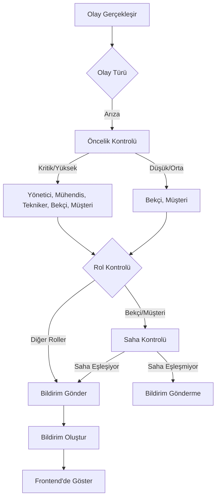

# 🔔 SolarVeyo Bildirim Sistemi Dokümantasyonu

## 📊 Genel Bakış

Bildirim sistemi, kullanıcıları önemli olaylar hakkında bilgilendirmek için tasarlanmıştır. Rol bazlı ve saha/santral bazlı filtreleme mekanizmaları içerir.

## 🎯 Bildirim Türleri ve Hedef Kitlesi

### 1. **Arıza Bildirimleri** 🔧

#### Kritik/Yüksek Öncelikli Arızalar
| Rol | Bildirim Alır mı? | Koşul |
|-----|------------------|--------|
| **SuperAdmin** | ✅ Evet | Tüm arızalar |
| **Yönetici** | ✅ Evet | Kendi şirketindeki tüm arızalar |
| **Mühendis** | ✅ Evet | Kendi şirketindeki tüm arızalar |
| **Tekniker** | ✅ Evet | Kendi şirketindeki tüm arızalar |
| **Bekçi** | ✅ Evet | **SADECE** atandığı sahalardaki arızalar |
| **Müşteri** | ✅ Evet | **SADECE** atandığı sahalardaki arızalar |

#### Düşük/Orta Öncelikli Arızalar
| Rol | Bildirim Alır mı? | Koşul |
|-----|------------------|--------|
| **SuperAdmin** | ❌ Hayır | - |
| **Yönetici** | ❌ Hayır | - |
| **Mühendis** | ❌ Hayır | - |
| **Tekniker** | ❌ Hayır | - |
| **Bekçi** | ✅ Evet | **SADECE** atandığı sahalardaki arızalar |
| **Müşteri** | ✅ Evet | **SADECE** atandığı sahalardaki arızalar |

### 2. **Bakım Bildirimleri** 🛠️

| Rol | Bildirim Alır mı? | Koşul |
|-----|------------------|--------|
| **Yönetici** | ✅ Evet | Tüm bakımlar |
| **Mühendis** | ✅ Evet | Tüm bakımlar |
| **Tekniker** | ✅ Evet | Tüm bakımlar |
| **Bekçi** | ✅ Evet | Atandığı sahalardaki bakımlar |
| **Müşteri** | ✅ Evet | Atandığı sahalardaki bakımlar |

### 3. **Vardiya Bildirimleri** 👮

| Rol | Bildirim Alır mı? | Koşul |
|-----|------------------|--------|
| **Yönetici** | ✅ Evet | Tüm vardiya bildirimleri |
| **Mühendis** | ✅ Evet | Tüm vardiya bildirimleri |
| **Bekçi** | ✅ Evet | Atandığı sahalardaki vardiyalar |

### 4. **İzin Talepleri** 📅

| Rol | Bildirim Alır mı? | Koşul |
|-----|------------------|--------|
| **Yönetici** | ✅ Evet | Tüm izin talepleri |
| **İzin Talep Eden** | ✅ Evet | Kendi izin talebinin durumu |

### 5. **Abonelik/Ödeme Bildirimleri** 💳

| Rol | Bildirim Alır mı? | Koşul |
|-----|------------------|--------|
| **Yönetici** | ✅ Evet | Plan değişiklikleri, ödeme hatırlatmaları |
| **SuperAdmin** | ✅ Evet | Yükseltme talepleri |

## 🔐 İzolasyon Mekanizmaları

### 1. **Saha/Santral İzolasyonu**
```javascript
// Bekçi ve Müşteri rolleri için
if (userProfile.rol === 'bekci' || userProfile.rol === 'musteri') {
  // Sadece atandığı sahalar
  const userSahalar = userProfile.sahalar || [];
  const userSantraller = userProfile.santraller || [];
  
  // Bildirim filtresi
  if (!userSahalar.includes(bildirim.sahaId)) {
    // Bildirim gösterilmez
  }
}
```

### 2. **Şirket İzolasyonu**
```javascript
// SuperAdmin hariç herkes
if (userProfile.rol !== 'superadmin') {
  // Sadece kendi şirketinin bildirimleri
  notifications = notifications.filter(n => 
    n.companyId === userProfile.companyId
  );
}
```

## 📍 Bildirim Veri Yapısı

```typescript
interface Notification {
  id: string;
  companyId: string;        // Şirket ID
  userId?: string;          // Hedef kullanıcı (opsiyonel)
  title: string;            // Bildirim başlığı
  message: string;          // Bildirim mesajı
  type: 'info' | 'warning' | 'error' | 'success';
  actionUrl?: string;       // Tıklanınca gidilecek sayfa
  read: boolean;            // Okundu mu?
  readBy: string[];         // Kimler okudu (array)
  hiddenBy: string[];       // Kimler gizledi (array)
  metadata: {
    sahaId?: string;        // İlgili saha
    santralId?: string;     // İlgili santral
    faultId?: string;       // İlgili arıza
    targetRoles?: string[]; // Hedef roller
    oncelik?: string;       // Öncelik seviyesi
  };
  createdAt: Timestamp;
}
```

## 🚀 Bildirim Gönderme Örnekleri

### Arıza Bildirimi Gönderme
```javascript
// arizaService.ts
if (faultData.oncelik === 'kritik') {
  // İlgili kullanıcıları bul
  const users = await getDocs(query(
    collection(db, 'kullanicilar'),
    where('companyId', '==', companyId),
    where('rol', 'in', ['yonetici', 'muhendis', 'tekniker', 'bekci'])
  ));
  
  for (const user of users.docs) {
    const userData = user.data();
    
    // Bekçi kontrolü
    if (userData.rol === 'bekci') {
      if (!userData.sahalar.includes(faultData.sahaId)) {
        continue; // Bu bekçiye bildirim gitmesin
      }
    }
    
    // Bildirim oluştur
    await createNotification({
      companyId,
      userId: user.id,
      title: '🚨 KRİTİK ARIZA',
      message: `${faultData.saha} sahasında acil müdahale!`,
      type: 'error',
      metadata: {
        sahaId: faultData.sahaId,
        faultId: docRef.id
      }
    });
  }
}
```

## 📱 Frontend'de Bildirim Gösterimi

### NotificationContext.tsx
```javascript
const filterByRole = (items: Notification[]) => {
  // 1. Rol kontrolü
  if (userProfile.rol === 'bekci' || userProfile.rol === 'musteri') {
    // 2. Saha kontrolü
    return items.filter(n => {
      const sahaOk = n.metadata.sahaId ? 
        userProfile.sahalar.includes(n.metadata.sahaId) : true;
      return sahaOk;
    });
  }
  
  return items; // Diğer roller tüm bildirimleri görür
};
```

## 📋 Bildirim Akış Şeması



## 🧱 Gerekli Firestore İndeksleri (Bildirimler)

Bu indeksler yüksek trafikte sorgu hatalarını (requires an index) ve yavaşlamayı önler.

- Zorunlu (mevcut):
  - `notifications`: `companyId ASC` + `createdAt DESC`
  - `notifications`: `companyId ASC` + `userId ASC` + `createdAt DESC`
- Opsiyonel (ileride sunucu tarafı saha/santral hedefleme geçişi için):
  - `notifications`: `companyId ASC` + `metadata.sahaId ASC` + `createdAt DESC`
  - `notifications`: `companyId ASC` + `metadata.santralId ASC` + `createdAt DESC`
  - `notifications`: `recipientIds ARRAY_CONTAINS` + `companyId ASC` + `createdAt DESC`

Dağıtım:

```bash
firebase deploy --only firestore:indexes
```

Not: `firestore.indexes.json` dosyasında tanımlıdır; Firebase hatası verdiğinde Konsol’daki “Create index” önerisini de kabul edebilirsiniz.

## 📈 Ölçeklenme Stratejisi

- Aşama 1 – Şirket + istemci filtreleri (mevcut)
  - Sorgu: `companyId` + `orderBy(createdAt)`; kullanıcıya özel/gizleme/saha-sant ral filtreleri istemci tarafında.
  - Yeterlilik: Orta hacim (10–50K bildirim) ve gerçek zamanlı feed için uygundur.

- Aşama 2 – Sunucu tarafı hedefleme (önerilen yükseltme)
  - Bildirim oluştururken hedef kullanıcıları belirle ve iki yaklaşımdan birini kullan:
    - “Tekil kayıt” modeli: Her alıcı için ayrı doküman (`userId` dolu). Okuma O(1), indeks: `companyId+userId+createdAt`.
    - “Liste” modeli: `recipientIds: string[]` ve sorguda `array-contains userId`. İndeks: `recipientIds CONTAINS + companyId + createdAt`.
  - Artıları: Daha az istemci işi, daha net yetkilendirme, büyük ölçek için stabil.

- Aşama 3 – Arşiv/TTL ve maliyet optimizasyonu
  - `expiresAt` alanı ile Cloud Scheduler/Functions temizliği.
  - Eski kayıtları `notifications_archive` koleksiyonuna taşıma.
  - Sorgu limitleri (20/50), sayfalama ve artımsal yükleme.

- Operasyonel notlar
  - Yazma yoğun akışlarda batch yazım kullanın (500/işlem) ve exponential backoff.
  - `hiddenBy/readBy` alanları kullanıcı-bazlı olduğu için koleksiyon büyüse bile okuma maliyeti kontrol altında kalır.

## 🎨 Bildirim Türleri ve Renkleri

| Tür | Renk | Kullanım Alanı | İkon |
|-----|------|---------------|------|
| **error** | 🔴 Kırmızı | Kritik arızalar, hatalar | 🚨 |
| **warning** | 🟠 Turuncu | Yüksek öncelikli arızalar | ⚠️ |
| **info** | 🔵 Mavi | Genel bilgilendirmeler | ℹ️ |
| **success** | 🟢 Yeşil | Başarılı işlemler | ✅ |

## 🔄 Bildirim Yaşam Döngüsü

1. **Oluşturma**: Olay tetiklendiğinde
2. **Filtreleme**: Rol ve saha bazlı
3. **Gösterim**: Header'da badge ile
4. **Okuma**: Kullanıcı tıkladığında
5. **Gizleme**: Kullanıcı istediğinde (soft delete)
6. **Silme**: Sadece SuperAdmin (hard delete)

## 🛠️ Özelleştirme Seçenekleri

### Kullanıcı Bazlı Gizleme
- Her kullanıcı kendi bildirimlerini gizleyebilir
- Diğer kullanıcıları etkilemez
- `hiddenBy` array'inde saklanır

### Toplu İşlemler
- Tümünü okundu işaretle
- Seçili bildirimleri gizle
- Filtreleme (okunmamış, tip, tarih)

## 📝 Test Senaryoları

### Senaryo 1: Bekçi İzolasyonu
1. Bekçi A → Isparta sahası atanmış
2. Bekçi B → Burdur sahası atanmış
3. Isparta'da arıza → Sadece Bekçi A bildirim alır ✅
4. Burdur'da arıza → Sadece Bekçi B bildirim alır ✅

### Senaryo 2: Öncelik Bazlı
1. Kritik arıza → Tüm teknik ekip + ilgili bekçi/müşteri
2. Düşük arıza → Sadece ilgili bekçi/müşteri

### Senaryo 3: Gizleme
1. Yönetici bildirimi gizler → Sadece yöneticiden gizlenir
2. Bekçi aynı bildirimi görmeye devam eder

## 🚧 Geliştirilecek Özellikler

- [ ] Email entegrasyonu
- [ ] SMS bildirimleri
- [ ] WhatsApp entegrasyonu
- [ ] Push notification (PWA)
- [ ] Bildirim sesleri
- [ ] Özel bildirim tercihleri
- [ ] Zamanlı bildirimler
- [ ] Bildirim şablonları

## 📞 İletişim Kanalları

Mevcut:
- ✅ In-app bildirimler
- ✅ Toast mesajları

Planlanan:
- ⏳ Email (Resend.com)
- ⏳ SMS (Twilio/Netgsm)
- ⏳ WhatsApp Business API
- ⏳ Push Notifications

---

*Son güncelleme: 2025-01-20*
*Versiyon: 2.0.0*
